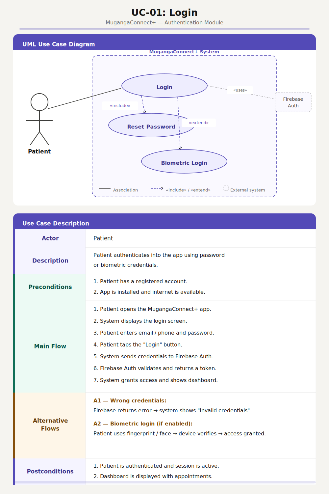
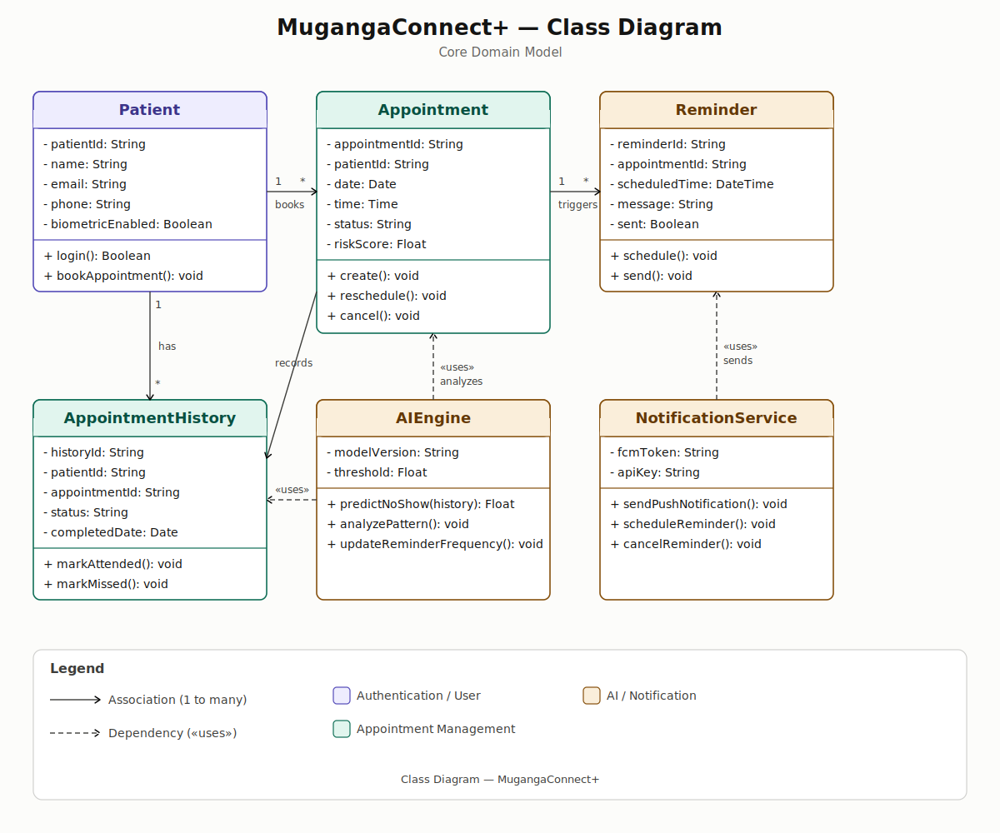
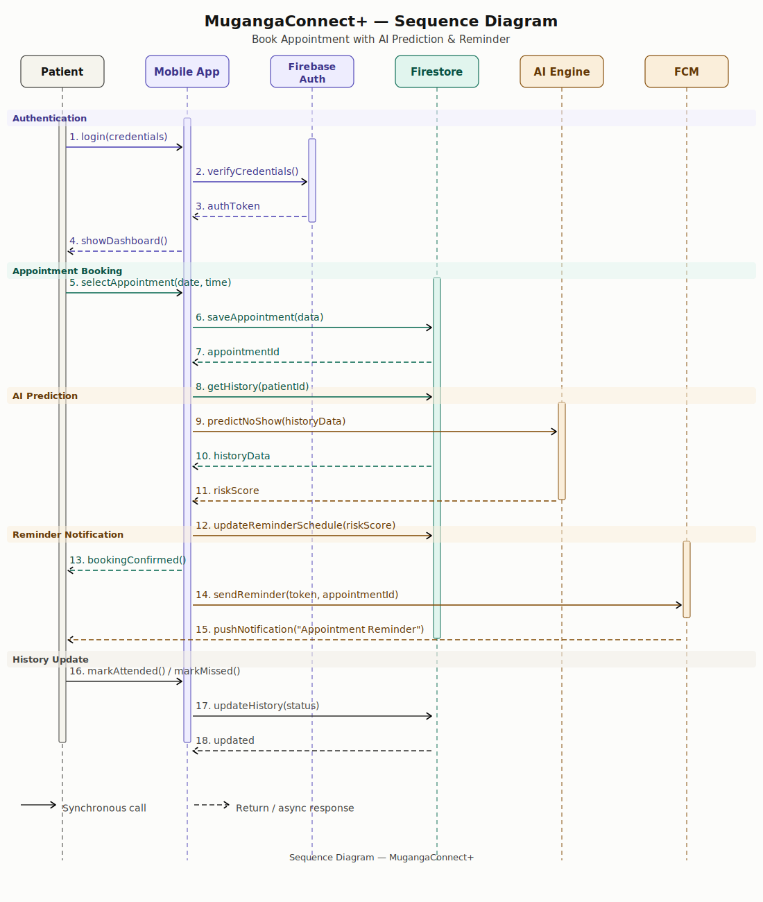

# MugangaConnect+

A mobile application designed to help patients easily book, manage, and track their medical appointments — with AI-powered reminders to reduce missed visits.

## Features

- Patient registration & secure login (including biometric)
- Book, reschedule, and cancel appointments
- Automated reminders (push notifications)
- AI prediction for missed appointments
- Appointment history tracking

## Tech Stack

| Layer        | Technology                          |
|--------------|-------------------------------------|
| Frontend     | Android Studio (Java / Kotlin)      |
| Backend      | Firebase (Auth + Firestore)         |
| Notifications| Firebase Cloud Messaging (FCM)      |
| Database     | Firebase / SQLite                   |

## Project Structure

```
MugangaConnect+/
├── app/
│   ├── src/main/java/       # Application logic
│   └── res/                 # UI layouts & resources
├── docs/
│   ├── SRS.md               # Software Requirements Specification
│   └── MyDocs.md            # Scrum Meeting Documentation
└── README.md
```

## Getting Started

1. Clone the repository
   ```bash
   git clone https://github.com/Muganga-Connect/MugangaConnect.git
   ```
2. Open in Android Studio
3. Connect your Firebase project (`google-services.json`)
4. Build and run on an Android device or emulator

## Team

| Name                      | Role                        |
|---------------------------|-----------------------------|
| Solide AZE                | UI/UX + Dev + Docs Lead     |
| Sifa Jolly Blandine       | UI/UX Design                |
| Mugisha Leopold           | Development                 |
| Cyuzuzo Lynda Arlette     | UI/UX Design                |
| Murisa Manzi Derick       | Development                 |
| Uwizeye Gentille          | Documentation & Testing     |
| Caleb Joseph Igisubizo    | UI/UX + Development         |
| Ange Kimberly MUKESHIMANA | UI/UX + QA                  |
| SHEMA Hubert              | Development                 |
| Janvier Niyomwungeri      | Dev + Documentation         |

## Diagrams

### Use Case Diagram
> Shows all patient interactions with the MugangaConnect+ system.



### Login Use Case
> Detailed UML use case description for the Login action.



### Class Diagram
> Core domain model showing all classes and their relationships.



### Activity Diagram
> Patient journey from app launch through booking, AI prediction, and reminders.



### Sequence Diagram
> Interactions between Patient, Mobile App, Firebase, AI Engine, and FCM.



### Data Flow Diagram
> Level 1 DFD showing data flows between all system processes and data stores.



---

## License

This project is developed as part of an academic program at AUCA.

> **Branch:** Documentation | **Maintained by:** Uwizeye Gentille
